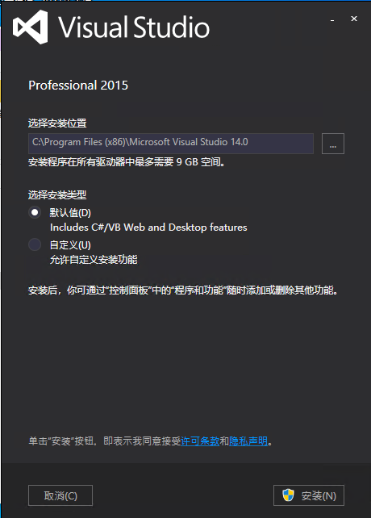
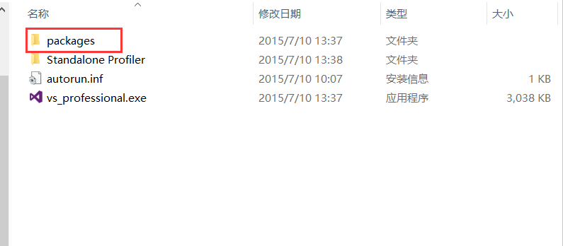
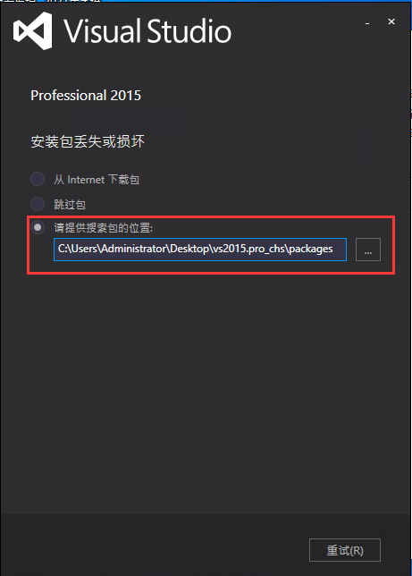
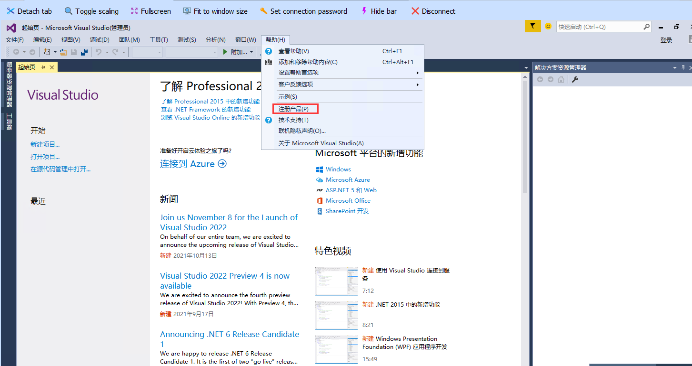

## visual studio 2015安装指南.md

* 下载 visual studio 2015 见文件目录下的下载文件
* 解压 vs2015.pro_chs.iso 文件后,双击 vs_professional.exe 文件

* 安装类型选择默认安装

* 安装过程中会提示安装包丢失或损坏,此时**此时选中请提供搜索包位置,并将路径选择到packages即可**

* 注册产品

