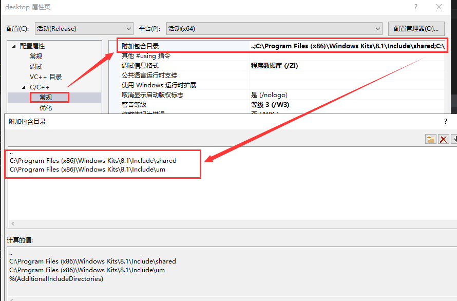
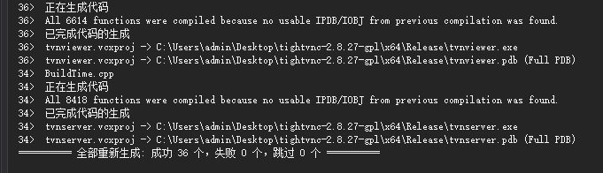

## 工程调试学习指南

* 该工程是`tightvnc`开源代码,用于学习`vnc`协议用

* 准备环境

  * 安装`visual studio 2015`
  * `WIN SDK8.1`

* 开始编译

  * 修改编译模式

    打开工程 `tightvnc2015.sln`，等工程就绪，生成模式改为 `Release Win32 `，等工程就绪；

  * 添加`WIN SDK8.1`到包含目录

    * 找到工程 `desktop `和 `tvnserver-app` 右击属性，C/C++，常规，附加包含目录，添加（第一行是两个点不能去掉）：

      `C:\Program Files (x86)\Windows Kits\8.1\Include\shared`
      `C:\Program Files (x86)\Windows Kits\8.1\Include\um`

      

      

  * 选中`tvnserver`，右键，选择设为启动项目

  * 右击解决方案,重新生成解决方案，编译通过

    

  * 注意事项

    * `若VS提示：无法打开包括文件: “TimeAPI.h”，双击错误提示，定位到所有引用该头文件的CPP，注释掉 #include "TimeAPI.h"，大概有两处；若修改了编译模式，例如改为 Release X64，同样要按照第2步添加SDK到包含目录。`

    * `若项目出现cannot open include file 'afxres.h'`

      `使用Everything查找afxres.h文件，发现只存在VS2010的库atlmfc下的include目录中。（我的电脑同时装了vs2010和vs2015）通过Everything查找atlmfc，找到VS2015安装目录下的atlmfc所在位置，将afxres.h复制到该目录下的include目录中。完成后，重新生成项目即可。`